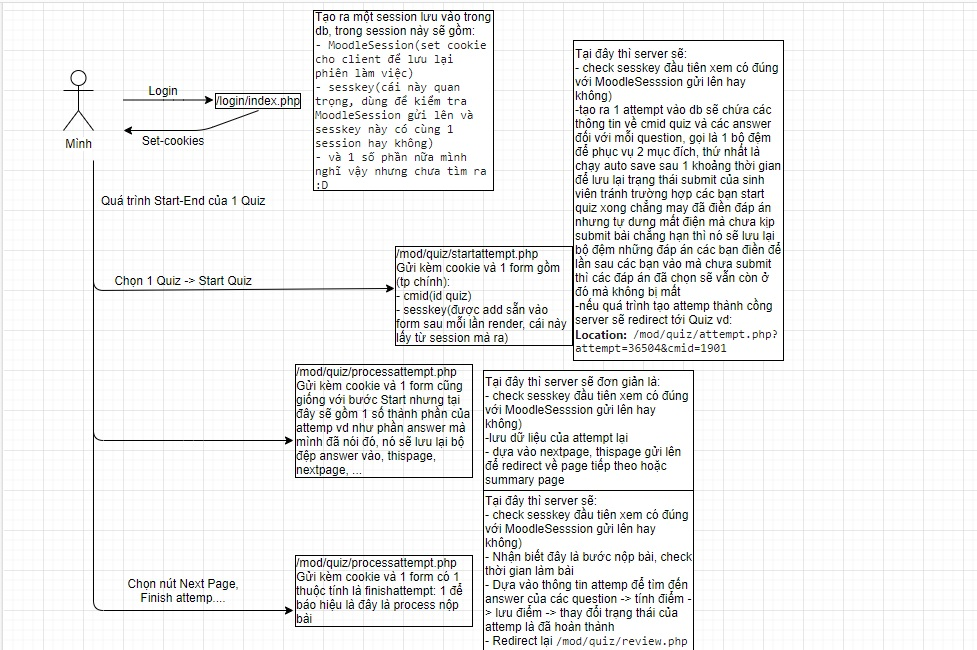
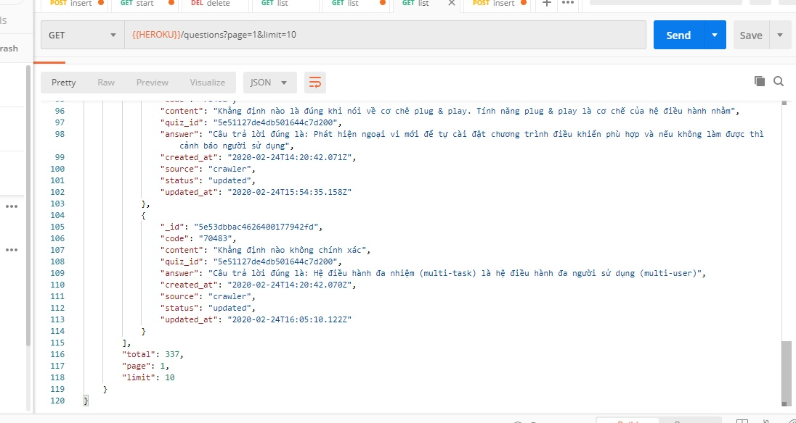

## Mở đầu
Thời điểm này dịch cô rô na (nCov19) đang hoành hành và các trường mẫu giáo, tiểu học, trung học, trung học phổ thông, đại học, cao học ,......... Đều được nghỉ và lúc đó trường mình đã triển khai phương pháp học "Blend Learning" :<, một phương pháp học online mà mình thấy là không hợp với mình :(. Môn học mà mình phải chiến đấu là Tin Học Cơ Sở 1, nghe có vẻ dễ nhỉ nhưng mình đã nhầm, nhìn cái đống đề cương nào là word, excel, powerpoint :((( dài dằng dặc cảm thấy khó thở và một đống các bài test nữa chứ :((, lúc này cuộc sống của mình rất hoang mang, không biết sẽ chống chọi với môn này ra sao...

## Ý tưởng
Buổi học online đầu tiên bắt đầu vào ngày 21/02/2020, sau gần 2 tháng nghỉ tết cuối cùng cũng được gặp lại các bạn yêu dấu thông qua một khung chát =)). Thầy lên lớp phổ biến nội dung học và cơ chế thi, tính điểm, lúc đó thầy có giới thiệu về một loạt các bài trắc nghiệm test không giới hạn và bảo làm càng nhiều thì càng ôn được nhiều vì thi cuối kỳ vào đó hết, bản tính lười và cũng bí thời gian vì đợt này đi làm cũng nhiều nên mình có nảy ra ý tưởng có nên tạo một con bot crawler tất cả các question trên course này về không nhỉ vì không giới hạn lượt làm bài mà, vì vậy mà mình bắt tay vào lên kế hoạch viết con bot này ngay.

## Quá trình xây dựng
Tối hôm đó mình dành thời gian để kiểm tra web, và nhận thấy một vài điều, là một con server-side-render, vì vậy mà không có api để có thể dễ dàng lấy dữ liệu, ở đây đặt ra khá nhiều giải pháp:
- thứ nhất có thể dùng request để lấy raw html rồi xử lý qua các element
- thứ 2 dùng headless browser để auto mọi thứ luôn
Điều đặt ra ở đây là việc lấy dữ liệu của 1 Quiz cần qua các bước: Login -> Start Quiz -> Submit Quiz -> Result Quiz. Thì nó phải trải qua 4 action như trên rồi cuối cùng mới có thể lấy được dữ liệu hoàn chỉnh bao gồm cả đáp án lẫn câu hỏi. Vì vậy phương án 1 đặt ra không "ăn liền cho lắm", tại sao mình lại nói vậy? Bởi vì sau khi dành chút thời gian xem qua flow để đoán cách thức hoạt động mình rút ra được một flow như sau:

Có thể thấy nếu theo phương án thứ nhất sẽ khá là phức tạp bởi vì có nhiều vấn đề phải xử lý:
- xử lý origin
- xử lý đối với mỗi Quiz là khác nhau bởi vì mỗi quiz có lượng câu hỏi là khác nhau
- số page của mỗi Quiz cũng khác nhau và không có 1 quy luật nào @@, ví dụ như bài 1 30 câu chia làm 3 page, nhưng bài 2 25 câu lại chia thành 6 page =)) 

Tới lúc đó mình nghĩ chắc phải dùng headless rồi, rồi xem qua DOM của trang thì thấy may mắn thay là cấu trúc DOM có vẻ khá dễ để có thể bóc tách dữ liệu. Ban đầu mình tính sẽ triển khai 1 API và 1 con mongodb để lưu thông tin cũng như có cái đầu ra dữ liệu, còn con bot sẽ viết code riêng và cho nó chạy ở ngoài nhưng mình không thể lúc nào cũng bật máy để bot chạy được, mình còn đi làm nữa, nên mình tạo thêm 1 con API nữa để phục vụ việc running con bot này.
- Đầu tiên là Design Database, mình làm khá đơn giản chỉ gồm các Collection: Site, Course, Quiz, Question nhưng cho đến khi làm xong con bot thì mới nhớ phải có 1 Collection để ghi lại history của bot nữa, vậy mình có làm thêm 1 Collection Log
- Tiếp theo là xây dựng API phục vụ từng collection
- Tiếp đến là xem qua puppeteer để viết con bot

May thay đúng vào cuối tuần 2 ngày t7, cn được nghỉ mình có thời gian chuyên tâm vào xây dựng hệ thống này, tốn khoảng 12 tiếng trong 2 ngày để xây dựng xong version 1 rất đơn sơ và thu về những bản ghi Questions đầu tiên :))

Rất hào hứng khi đứa con tinh thần có thể bắt đầu hoạt động, sau đó hoạt động được khoảng vài giờ thì gặp một vài bug trong các lần crawler khác nhau ở các Quiz, mình lại tu sửa và nâng cấp và hoàn thành hơn con API để monitor con bot đó. Lúc đó mình lại nhận thấy rằng liệu con bot chạy nhanh như này thì có ăn đòn k nhỉ, 1 lần chạy mất có 1,2 phút mà cả Quiz Max là 20 phút lận từ đó bắt đầu thêm timeout để chạy chậm đi 1 Quiz sẽ làm khoảng 10 phút, dần dần mình nghĩ ra nhiều thứ để phát triển hơn và quyết định viết Blog này.

## Định hướng phát triển tiếp
Mình viết blog này khi con bot đang hoạt động ở version đầu tiên, sau 2 ngày bắt đầu phát triển, dù cũng khá đủ chức năng và cho đến giờ đã thu đc 337 questions trong 11 bài test (có vẻ quỹ câu hỏi của trường hơi ít và lặp lại nhiều qua các bài test thì phải @@). Tiến tới mình sẽ không chỉ crawler = bot nữa mà sau khi chia sẻ bài này mình sẽ phát triển hệ thống crawler = tay và các bạn hoàn toàn có thể tự crawler được chỉ cần thông qua 1 link đáp án và sessionId để bot truy cập vào là được không có động gì vào tài khoản các bạn đâu. Bởi vì có những course không giống course này tức là chỉ có nhưng bài kiểm tra định kỳ và đc làm 1 lần vì vậy mà bot k thể crawler đc mà phải nhờ vào các link đáp án của các bạn để có thể tổng hợp được nhiều question hơn thì quỹ câu hỏi để các bạn search cũng sẽ rộng hơn.
Up comming: 
- web app UI
- crawler from url and session for every one
- export, import
Ngoài ra mình sẽ thử sử dụng phương án thứ nhất để crawler tức là sẽ chỉ sử dụng các request để crawler và không phụ thuộc vào headless nữa sẽ giúp tăng hiệu năng và giảm chi phí tài nguyên, headless khá nặng vì phải có hỗ trợ của 1 nhân chrominum để chạy, và khi deploy và run trên docker khá khó khăn.

## Kết thúc
Mục đích tạo ra không phải vì mục đích xấu =)), mình chỉ muốn giúp các bạn có 1 đề cương hoàn chỉnh để ôn tập đạt điểm cao mà thôi. Nhưng đừng public rộng quá đến tai các thầy cô thì mình đi đời đó :))