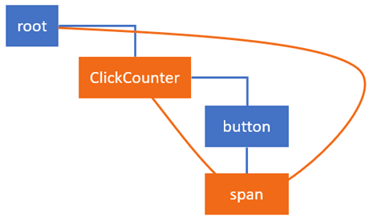
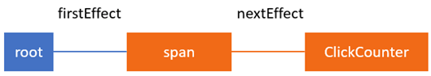

## Lặn sâu vào update state and props trong react
##### Dựa trên sự giải thích của tác giả Maxim Koretskyi qua bài viết [In-depth explanation of state and props update in React](https://indepth.dev/in-depth-explanation-of-state-and-props-update-in-react/)

Trước tiên để hiểu được bài viết này bạn cần có một cái nhìn trực quan về thuật toán reconciliation mới của react thông qua bài viết trước đó cua mình.

Mình sẽ giải thích dựa trên một ví dụ đơn giản với 1 button tăng số lượng bạn có thể thử với nó tại [đây](https://stackblitz.com/edit/react-jwqn64).
```javascript
class ClickCounter extends React.Component {
    constructor(props) {
        super(props);
        this.state = {count: 0};
        this.handleClick = this.handleClick.bind(this);
    }

    handleClick() {
        this.setState((state) => {
            return {count: state.count + 1};
        });
    }
    
    componentDidUpdate() {}

    render() {
        return [
            <button key="1" onClick={this.handleClick}>Update counter</button>,
            <span key="2">{this.state.count}</span>
        ]
    }
}
```
Ở trên component này mình có sử dụng life cycle componentDidUpdate sẽ giúp mình chứng minh cách thức react thêm effect này vào để gọi trong quá trình commit. Nào hãy cùng nhìn tổng thể về các quá trình mà react thực hiện trong giai đoạn render và commit.
Quá trình **completeWork**:
- update thuộc tính **count** trong `state` của **ClickCounter**
- gọi hàm `render` để lấy danh sách các node children và thực hiện công việc so sánh
- update props cho thẻ `span`
Quá trình **commitRoot**:
- update nội dung (textContent) của DOM element `span`
- gọi hàm componentDidUpdate.

Trước khi đi sâu vào các quá trình đó, ta hãy xem xét cách React lên lịch (schedule) khi chúng ta gọi `setState` trong lúc click vào button:
	Khi chúng ta click vào button, event onClick sẽ được kích hoạt và sẽ thực hiện callback mà ta truyền vào event đó, trong ví dụ của chúng ta thì callback đó đơn giản là tăng count của state lên 1. Trong khi đó mỗi component của React sẽ được liên kết với 1 updater(là một object đặc biệt của 1 component, nếu ta console.log(this.updater) thì updater chính là một object được nhúng thêm vào 1 component) đó là một cổng kết nối giữa component và React-core, điều này làm cho react có thể đc áp dụng ở đa nền tảng dù là DOM, native, desktop, ... thì chỉ cần viết 1 lần, dùng được ở mọi nơi. Ở ví dụ này chúng ta sử dụng DOM, vì vậy chúng ta sẽ xem xét updater này đc áp dụng đối với DOM. Trong trường hợp ClickCounter là một component thì updater tương ứng với nó sẽ là classComponentUpdater, nó chịu trách nhiệm có thể lấy ra instance của Fiber đó, hàng đợi các updates (queuing updates) và lên lịch cho 1 công việc (scheduling work).
	Khi một Update được đẩy vào hàng đợi, thì Fiber node trong ví dụ của chúng ta sẽ có cấu trúc như sau: 
```javascript
{
    stateNode: new ClickCounter,
    type: ClickCounter,
    updateQueue: {
         baseState: {count: 0}
         firstUpdate: {
             next: {
                 payload: (state) => { return {count: state.count + 1} }
             }
         },
         ...
     },
     ...
}
```
Bạn thấy đấy, hàm `updateQueue.firstUpdate.next.payload` chính là cái callback mà chúng ta truyền vào `setState` trong onClick của ClickCounter component. Nó biểu thị cho update đầu tiên cần được thực hiện trong quá trình render.
### Thực hiện update cho ClickCounter Fiber Node
Trong bài viết trước chúng ta đã nói về vai trò của nextUnitOfWork. Cụ thể là nó sẽ chứa tham chiếu đến Fiber Node trong WorkInProcess Tree mà có công việc cần thực hiện. Trong quá trình React duyệt cây Fibers thì nó sử dụng biến này để biết có còn Fiber Node nào mà chưa hoàn thành công việc hay không.
Bắt đầu bằng việc React thêm callback từ `setState` vào `updatesQueue` trong ClickCounter Fiber Node và đặt lịch công việc cho nó. React bước vào giai đoạn render. Nó sẽ duyệt từ `HostRoot` Fiber Node từ hàm `renderRoot`. Nó sẽ đi qua rất nhanh các Node cho đến khi nó gặp một Node có công việc cần phải thực hiện. Trong trường hợp của chúng ta chỉ có ClickCounter Node là có công việc cần thực hiện. Tại lúc này thì tất cả các công việc đều được lưu trữ trong clone Node là alternate( như đã nói trong bài trước thì react có 2 tree chính là current và WIP, thì alternate của current sẽ là WIP và ngược lại), nếu là lần đầu và alternate chưa có thì react sẽ tạo bản sao node đó thông qua `createWorkInProgress` trước khi thực hiện update. Và khi đó nextUnitOfWork của chúng ta đã tới được alternate của ClickCounter Fiber Node.
### beginWork
Đầu tiên fiber của chúng ta sẽ nhảy vào hàm beginWork.
>Since this function is executed for every Fiber node in a tree it’s a good place to put a breakpoint if you want to debug the **render** phase. I do that often and check the type of a Fiber node to pin down the one I need.

Hàm beginWork chỉ đơn giản là một biểu thức switch lớn với nhiều case là các các công việc thực hiện đối với từng loại Node thông qua tag của nó. Trong trường hợp của chúng ta thì ClickCounter là một ClassComponent vì vậy mà case của nó sẽ thế này:
```javascript
function beginWork(current$$1, workInProgress, ...) {
    ...
    switch (workInProgress.tag) {
        ...
        case FunctionalComponent: {...}
        case ClassComponent:
        {
            ...
            return updateClassComponent(current$$1, workInProgress, ...);
        }
        case HostComponent: {...}
        case ...
}
```
Và chúng ta sẽ nhảy vào hàm updateClassComponent. Tùy thuộc vào việc nó là lần đầu tiên render hay là thực hiện tiếp công việc hay là một update, React sẽ hoặc là tạo ra một instance mới hoặc chỉ đơn giản là update instance đó.
```javascript
function updateClassComponent(current, workInProgress, Component, ...) {
    ...
    const instance = workInProgress.stateNode;
    let shouldUpdate;
    if (instance === null) {
        ...
        // In the initial pass we might need to construct the instance.
        constructClassInstance(workInProgress, Component, ...);
        mountClassInstance(workInProgress, Component, ...);
        shouldUpdate = true;
    } else if (current === null) {
        // In a resume, we'll already have an instance we can reuse.
        shouldUpdate = resumeMountClassInstance(workInProgress, Component, ...);
    } else {
        shouldUpdate = updateClassInstance(current, workInProgress, ...);
    }
    return finishClassComponent(current, workInProgress, Component, shouldUpdate, ...);
}
```
## Thực hiện update cho ClickCounter Fiber
Trong trường hợp này khi ta gọi setState thì chúng ta đã có instance của ClickCounter, vì vậy chúng ta sẽ nhảy vào hàm `updateClassInstance`. Tại đây thì React thực hiện phần lớn các công việc của một class component, dưới đây là những hoạt động quan trọng được thực hiện theo thứ tự là: 
-   gọi  `UNSAFE_componentWillReceiveProps****()****`  hook (không còn dùng nữa)
-   thực hiện update trong  `updateQueue`  và tạo ra một state mới
-   gọi  `getDerivedStateFromProps`  với state mới và trả về kết quả
-   gọi  `shouldComponentUpdate`  để biết liệu component có muốn update hay không, nếu trả về  `false`, bỏ qua toàn bộ quá trình render, bao gồm việc gọi  `render`  trên component này và trong các children của nó; nếu `true` thì sẽ thực hiện tiếp công việc
-   gọi  `UNSAFE_componentWillUpdate`(không còn dùng nữa)
-   thêm một effect để kích hoạt  `componentDidUpdate`  lifecycle hook
>Although the effect to call `componentDidUpdate` is added in the  `render`  phase, the method will be executed in the following  `commit`  phase.
- update `state` và `props` trong instance của component
(`state` và `props` luôn được update trước khi gọi tới hàm `render` vì đơn giản là hàm `render` phụ thuộc vào chính `state` và `props` nếu chúng k đc update trước khi `render` thì kết quả thu về không có bất kỳ thay đổi nào so với lần trước)
Ok vậy là chúng ta đã biết được những hoạt động gì sẽ xảy ra đối với `ClickCounter` component trong giai đoạn render. Hãy cùng đi vào xem các hoạt động đó biến đổi giá trị của fiber node như thế nào. Khi React begin work, fiber node của `ClickCounter` sẽ trong như thế này:
```javascript
{
    effectTag: 0,
    elementType: class ClickCounter,
    firstEffect: null,
    memoizedState: {count: 0},
    type: class ClickCounter,
    stateNode: {
        state: {count: 0}
    },
    updateQueue: {
        baseState: {count: 0},
        firstUpdate: {
            next: {
                payload: (state, props) => {…}
            }
        },
        ...
    }
}
```
Sau khi công việc hoàn tất, nó sẽ trông như thế này:
```javascript
{
    effectTag: 4,
    elementType: class ClickCounter,
    firstEffect: null,
    memoizedState: {count: 1},
    type: class ClickCounter,
    stateNode: {
        state: {count: 1}
    },
    updateQueue: {
        baseState: {count: 1},
        firstUpdate: null,
        ...
    }
}
```
#### hãy dành một chút thời gian quan sát và so sánh 2 fiber node này
Sau khi update thì giá trị của `count` trong `memoizedState`  và `baseState` trong `updateQueue` sẽ là 1. React cũng update giá trị của `count` trong instance(`stateNode`) `state` cũng thành 1.
Ở điểm này, chúng ta không còn update trong `updatesQueue` nữa vì vậy `firstNext` sẽ là null. Và quan trọng hơn là trong quá trình update chúng ta đã thay đỏi `effectTag` từ 0 thành 4(trong binary là 100) có nghĩa là bit thứ 3 đã được thay đổi thành 1.
Tóm gọn quá trình này thì khi mà hoạt động trên `ClickCounter` Fiber node, React sẽ gọi pre-mutation( tiền-biến đổi) life cycle method, update state và tạo ra những side-effect tương ứng.
### Reconciling children đối với ClickCounter Fiber
Một khi những công việc trước đã hoạt thành, React sẽ nhảy vào `finishClassComponent`. Đây là nơi mà React sẽ gọi hàm `render` của component đó và áp dụng [thuật toán so sánh](https://reactjs.org/docs/reconciliation.html#the-diffing-algorithm) đối với các children return từ hàm `render` của component này. Ý chính là:
>When comparing two React DOM elements of the same type, React looks at the attributes of both, keeps the same underlying DOM node, and only updates the changed attributes.

Ở điểm này có 2 vấn đề chính cần phải nắm được. **Một là**, khi React thực hiện reconcilition đối với các child, nó sẽ tạo hoặc update một Fiber Node cho mỗi child React Element returned từ hàm render. Và hàm `finishClassComponent` sẽ trả về tham chiếu đến children đầu tiên của current Fiber Node. Nó sẽ được gán cho `nextUnitOfWork` và thực hiện sau đó trong `workloop`. **Hai là**, React updates `props` trên mỗi children trong quá trình nó thực hiện công việc của parent, để làm việc đó nó sử dụng dữ liệu từ ReactElement  return từ hàm `render`.
Ví dụ, trước khi `span` được react reconcilition trong quá trình thực hiện công việc trên `ClickCounter` thì **Fiber Node** của span có dạng:
```javascript
{
    stateNode: new HTMLSpanElement,
    type: "span",
    key: "2",
    memoizedProps: {children: 0},
    pendingProps: {children: 0},
    ...
}
```
Và đây là **React Element** của span được return từ hàm `render` của `ClickCounter`:
```javascript
{
    $$typeof: Symbol(react.element)
    key: "2"
    props: {children: 1}
    ref: null
    type: "span"
}
```
Như bạn thấy đó, `props` của 2 cái khác nhau, và trong hàm `createWorkInProgress` nó sử dụng dữ liệu đó để tạo ra alternate Fiber Node. Vì vậy sau khi hoàn thành reconcilition đối với children của `ClickCounter` component, `span` Fiber node sẽ có pendingProps được update đúng với giá trị của `span` React Element:
```javascript
{
    stateNode: new HTMLSpanElement,
    type: "span",
    key: "2",
    memoizedProps: {children: 0},
    pendingProps: {children: 1},
    ...
}
```
Có thể thấy `pendingProps` được thay đổi nhưng `memoizedProps` thì chưa vì chúng ta nên nhớ rằng đang thực hiện work trong `ClickCounter` Fiber Node vì vậy mà `memoizedProps` của `span` sẽ được update khi thực hiện work trong `span` Fiber Node. 
Và đó là những gì được thực hiện của `ClickCounter` Fiber trong giai đoạn `render`. Sau đó giá trị trả về cho `nextUnitOfWork` tiếp theo sẽ là children của `ClickCounter` trong trường hợp này là `button`, vì là không có gì cần thực hiện trong node này nên `nextUnitOfWork` sẽ là sibling của button chính là `span` Fiber node. 
## Thực hiện update cho Span fiber
Tại lúc này thì `nextUnitOfWork` đã trỏ tới alternate của `span` Fiber và React bắt đầu thực hiện công việc trên đó. Giống với các bước khi thực hiện đối với `ClickCounter`, chúng ta sẽ bắt đầu với `beginWork`:
Trong trường hợp này `span` có tag là `HostComponent` vì vậy nó sẽ switch đến case tương ứng:
```javascript
function beginWork(current$$1, workInProgress, ...) {
    ...
    switch (workInProgress.tag) {
        case FunctionalComponent: {...}
        case ClassComponent: {...}
        case HostComponent:
          return updateHostComponent(current, workInProgress, ...);
        case ...
}
```
kết thúc với hàm `updateHostComponent`. 
### Reconciling children trên span fiber

### Completing work cho Span Fiber node
Khi mà `beginWork` xong, node này sẽ nhảy vào `completeWork`. Trước khi đó thì React cần phải update `memoizedProps` trên `span` fiber. Bạn có nhớ rằng khi thực hiện work trên `ClickCounter` thì `span` fiber đã được update `pendingProps` và đây là lúc mà `pendingProps` sẽ được sử dụng để update `memoizedProps`:
```javascript
function performUnitOfWork(workInProgress) {
    ...
    next = beginWork(current$$1, workInProgress, nextRenderExpirationTime);
    workInProgress.memoizedProps = workInProgress.pendingProps;
    ...
}
```
Sau đó nó gọi tới `completeWork` của `span` thì ở tại đây nó cũng là 1 biếu thức switch lớn giống với `beginWork`:
```javascript
function completeWork(current, workInProgress, ...) {
    ...
    switch (workInProgress.tag) {
        case FunctionComponent: {...}
        case ClassComponent: {...}
        case HostComponent: {
            ...
            updateHostComponent(current, workInProgress, ...);
        }
        case ...
    }
}
```
Nó sẽ gọi `updateHostComponent` vì `span` là HostComponent, trong hàm này thì React sẽ thực hiện những hoạt động sau:
-   chuẩn bị update cho DOM
-   thêm những update đó vào  `updateQueue`  của  `span`  fiber
-   thêm các effect vào DOM
Trước khi các hoạt động đó được thực hiện, `span` Node sẽ trông như này:
```javascript
{
    stateNode: new HTMLSpanElement,
    type: "span",
    effectTag: 0
    updateQueue: null
    ...
}
```
và khi hoàn thành nó sẽ thế này:
```javascript
{
    stateNode: new HTMLSpanElement,
    type: "span",
    effectTag: 4,
    updateQueue: ["children", "1"],
    ...
}
```
Chúng ta thấy rằng cũng giống như `ClickCounter` là thay đổi `effectTag` và `updateQueue` . `updateQueue` chứa payload sẽ được sử dụng để update. 
Cuối cùng khi mà React đi qua tất cả các công việc của cả Tree thì giai đoạn render cũng kết thúc. Bây giờ nó sẽ gán completed alternate tree cho `finishedWork` là property của `FiberRoot`. Đây là tree mới cần được update trên màn hình, (thao tác trực tiếp với DOM), công việc update DOM này có thể thực hiện ngay hoặc thực hiện sau tùy vào thời gian còn lại mà main thread dành cho lần làm việc này.
## Effect List(cấu trúc dữ liệu là một linkedList)
Trong trường hợp này, khi trải qua giai đoạn trước thì effect-list cũng được tạo ra và `span` node và `ClickCounter` node đều có side effects. React xây dựng effects list trong `completeUnitOfWork`, tại đây thì `firstEffect` của `HostFiber` sẽ được liên kết tới side effects của `span`:

Và đây là linked list đó: 

## Giai đoạn commit
Giai đoạn này bắt đầu bằng hàm `completeRoot`. Trước khi nó bắt đầu làm một việc gì nó sẽ gán `finishedWork` của `FiberRoot` thành `null`:
```javascript
root.finishedWork = null;
```
Không giống như giai đoạn **render**, giai đoạn **commit** này là đồng bộ và nó sẽ thực hiện cho đến khi kết thúc. Giai đoạn **commit** là nơi mà React update DOM và gọi các post-mutation(hậu-thay đổi) lifecycle như `componentDidUpdate`. Để làm điều đó, nó duyệt qua danh sách các effects (effects list) mà nó đã xây dựng trước đó trong giai đoạn `render` và thực thi các effect đó.
Nhưng effect đó là: 
```javascript
{ type: ClickCounter, effectTag: 5 }
{ type: 'span', effectTag: 4 }
```
### Applying Effects
Cùng xem cách mà React áp dụng các effects đó như nào. Hàm `commitRoot`, được sử dụng để áp dụng các effect đó thì chứa 3 hàm nhỏ bên trong.
```javascript
function commitRoot(root, finishedWork) {
    commitBeforeMutationLifecycles()
    commitAllHostEffects();
    root.current = finishedWork;
    commitAllLifeCycles();
}
```
Mỗi hàm đó là một vòng lặp mà sẽ đi qua danh sách các effects và tùy vào type của effects mà nó sẽ thực hiện công việc tương ứng. Trong trường hợp của chúng ta nó sẽ gọi `componentDidUpdate` của `ClickCounter` và update `textContent` của `span`. Có rất nhiều thứ sẽ xảy ra trong các hàm này ví dụ: `commitBeforeMutationLifecycles` tìm `Snapshot` effect và gọi `getSnapshotBeforeUpdate`, nhưng vì chúng ta không có sử dụng lifecycle này nên sẽ k được thực hiện.
### DOM updates
Sau khi `commitBeforeMutationLifecycles` xong thì đến `commitAllHostEffects`. Đây là nơi mà React sẽ thay đổi text của thẻ `span` từ 0 sang 1. Ở đây sẽ nhảy vào nhánh Update tương ứng với `effectTag` của nó: 
```javascript
function updateHostEffects() {
    switch (primaryEffectTag) {
      case Placement: {...}
      case PlacementAndUpdate: {...}
      case Update:
        {
          var current = nextEffect.alternate;
          commitWork(current, nextEffect);
          break;
        }
      case Deletion: {...}
    }
}
```
bằng việc đi vào `commitWork` chúng ta cuối cùng sẽ đi vào hàm `updateDOMProperties`. Nó nhận `updateQueue` payload mà đã được thêm vào Fiber Node trong giai đoạn `render`, và update `textContent` của thẻ `span`:
```javascript
function updateDOMProperties(domElement, updatePayload, ...) {
  for (let i = 0; i < updatePayload.length; i += 2) {
    const propKey = updatePayload[i];
    const propValue = updatePayload[i + 1];
    if (propKey === STYLE) { ...} 
    else if (propKey === DANGEROUSLY_SET_INNER_HTML) {...} 
    else if (propKey === CHILDREN) {
      setTextContent(domElement, propValue);
    } else {...}
  }
}
```
Sau khi DOM update xong thì React sẽ gán `finishedWork` tree cho `HostRoot`.
```javascript
root.current = finishedWork;
```
### Gọi các hậu biến đổi (post-mutation) lifecycle hook
Hàm cuối cùng là `commitAllLifecycles`, đây là nơi mà React sẽ gọi các post-mutation trong TH của chúng ta nó sẽ gọi `componentDidUpdate` của `ClickCounter` component 
```javascript
function commitAllLifeCycles(finishedRoot, ...) {
    while (nextEffect !== null) {
        const effectTag = nextEffect.effectTag;

        if (effectTag & (Update | Callback)) {
            const current = nextEffect.alternate;
            commitLifeCycles(finishedRoot, current, nextEffect, ...);
        }
        
        if (effectTag & Ref) {
            commitAttachRef(nextEffect);
        }
        
        nextEffect = nextEffect.nextEffect;
    }
}
```
và bên trong `commitLifeCycles`:
```javascript
function commitLifeCycles(finishedRoot, current, ...) {
  ...
  switch (finishedWork.tag) {
    case FunctionComponent: {...}
    case ClassComponent: {
      const instance = finishedWork.stateNode;
      if (finishedWork.effectTag & Update) {
        if (current === null) {
          instance.componentDidMount();
        } else {
          ...
          instance.componentDidUpdate(prevProps, prevState, ...);
        }
      }
    }
    case HostComponent: {...}
    case ...
}
```
Tại đây nó đã gọi `componentDidUpdate`.

## Kết thúc
Phù vậy là hoàn thành bài viết này, dựa trên bài viết gốc của tác giả [Maxim Koretskyi](https://indepth.dev/author/maxkoretskyi/), mình đã dịch lại và sử dụng những ngôn từ dễ hiểu hơn. Cảm ơn mọi người đã theo dõi!

